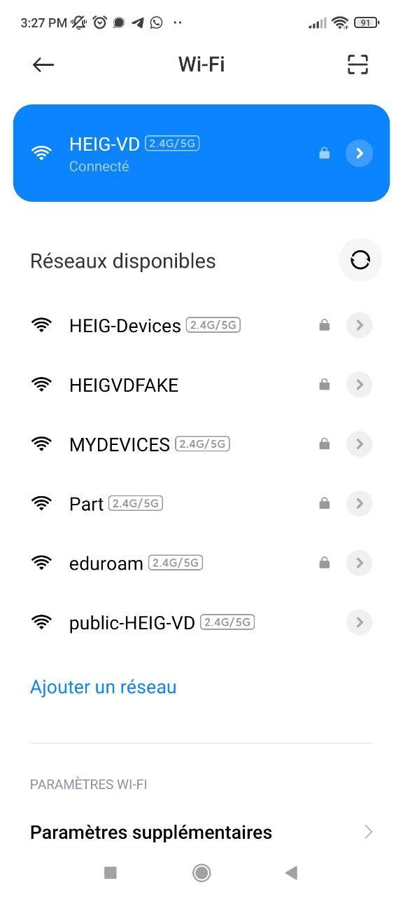

- [Livrables](#livrables)
- [Échéance](#%c3%89ch%c3%a9ance)
- [Quelques éléments à considérer](#quelques-éléments-à-considérer-pour-les-parties-2-et-3-)
- [Travail à réaliser](#travail-%c3%a0-r%c3%a9aliser)

# Sécurité des réseaux sans fil

## Laboratoire 802.11 Sécurité WPA Entreprise

__A faire en équipes de deux personnes__

### Objectif :

1.	Analyser les étapes d’une connexion WPA Entreprise avec une capture Wireshark
2.	Implémenter une attaque WPE (Wireless Pwnage Edition) contre un réseau WPA Entreprise
1.  Implémenter une attaque GTC Dowgrade contre un réseau WPA Entreprise


## Quelques éléments à considérer pour les parties 2 et 3 :

Les parties 2 et 3 nécessitent du matériel particulier. Si vous avez travaillé jusqu'ici avec l'interface WiFi interne de votre laptop, il y a des fortes probabilités qu'elle puisse aussi être utilisée pour les attaques Entreprise. Cela dépendra de la capacité de votra interface d'être configurée en mode AP. Ces attaques ne fonctionnent pas avec toutes les interfaces Alfa. Il faudra utiliser le bon modèle.

En principe, il devrait être possible de démarrer vos machines en Kali natif (à partir d'une clé USB, avec une distro live par exemple) ou d'employer une autre version de Linux si vous voulez utiliser votre propre interface 

## Voici quelques informations qui peuvent vous aider :

- Solution à l’erreur éventuelle « ```Could not configure driver mode``` » :

```
nmcli radio wifi off
rfkill unblock wlan
```
-	Pour pouvoir capturer une authentification complète, il faut se déconnecter d’un réseau et attendre 1 minute (timeout pour que l’AP « oublie » le client) 
-	Les échanges d’authentification entreprise peuvent être facilement trouvés utilisant le filtre d’affichage « ```eap``` » dans Wireshark
-   Il est __impératif__ de bien fixer le cannal lors de vos captures


## Travail à réaliser

### 1. Analyse d’une authentification WPA Entreprise

Dans cette première partie (la moins fun du labo...), vous allez capturer une connexion WPA Entreprise au réseau de l’école avec Wireshark et fournir des captures d’écran indiquant dans chaque capture les données demandées.

A tittre d'exemple, voici [une connexion WPA Entreprise](files/auth.pcap) qui contient tous les éléments demandés. Vous pouvez utiliser cette capture comme guide de ce que la votre doit contenir. Vous pouvez vous en servir pour votre analyse __comme dernière ressource__ si vos captures ne donnent pas le résultat désiré ou s'il vous manquent des éléments importants dans vos tentatives de capture.

Pour réussir votre capture, vous pouvez procéder de la manière suivante :

-   Identifier l'AP le plus proche, en identifiant le canal utilisé par l’AP dont la puissance est la plus élevée (et dont le SSID est HEIG-VD...). Vous pouvez faire ceci avec ```airodump-ng```, par exemple

-   Lancer une capture avec Wireshark

-   Etablir une connexion depuis un poste de travail (PC), un smartphone ou n'importe quel autre client WiFi. __Attention__, il est important que la connexion se fasse à 2.4 GHz pour pouvoir sniffer avec les interfaces Alfa

- Comparer votre capture au processus d’authentification donné en théorie (n’oubliez pas les captures d'écran pour illustrer vos comparaisons !). En particulier, identifier les étapes suivantes :
	
	- Requête et réponse d’authentification système ouvert
	
	  
	
	- Requête et réponse d’association (ou reassociation)
	
	
	
	- Négociation de la méthode d’authentification entreprise (TLS?, TTLS?, PEAP?, LEAP?, autre?)
	
	
	
	3 paquets permettent d'identifier la négotiation:
	
	
	
	> 1. L'AP essaie de démarrer une connexion de type EAP-TLS
	
	> 2. Le client refuse, et lui indique avec un message "Legacy Nak" qu'il préfère une authentification EAP-PEAP
	
	
	
	> 3. L'AP commence l'authentification PEAP
	
	
	
	- Phase d’initiation
	
	
	
	
	
	- Phase hello :
	
	  - Version TLS
	  - Suites cryptographiques et méthodes de compression proposées par le client et acceptées par l’AP
	  - Nonces
	  - Session ID
	
	  > Hello client:
	
	  
	
	  > Hello server:
	
	  
	
	- Phase de transmission de certificats
	
	  > Le serveur transmet ses certificats en  même temps que le `Hello`. Comme PEAP est utilisé, le client n'a pas de certificat à envoyer 
	
	
	
	- Echanges des certificats
	  - Change cipher spec
	
	  
	
	- Authentification interne et transmission de la clé WPA (échange chiffré, vu par Wireshark comme « Application data »)
	
	
	
	
	
	- 4-way handshake
	
	

### Répondez aux questions suivantes :

> **_Question :_** Quelle ou quelles méthode(s) d’authentification est/sont proposé(s) au client ?
> 
> **_Réponse :_** EAP TLS et EAP PEAP ont été proposées au client lors de la négociation.

---

> **_Question:_** Quelle méthode d’authentification est finalement utilisée ?
> 
> **_Réponse:_** EAP-TLS a été refusé par le client, donc c'est EAP-PEAP a été utilisé.

---

> **_Question:_** Arrivez-vous à voir l’identité du client dans la phase d'initiation ? Oui ? Non ? Pourquoi ?
>
> **_Réponse:_** On voit que l'identité du client est `einet\joel.gonin`


---

> **_Question:_** Lors de l’échange de certificats entre le serveur d’authentification et le client :
> 
> - a. Le serveur envoie-t-il un certificat au client ? Pourquoi oui ou non ?
> 
> **_Réponse:_** Le serveur envoie un certificat lors du `Server Hello`. Cela permet au client d'établir la connexion TLS avec le serveur.
> 
> - b. Le client envoie-t-il un certificat au serveur ? Pourquoi oui ou non ?
> 
> **_Réponse:_** Le client n'envoie pas de certificat au serveur, car PEAP utilise l'authentification interne au tunnel TLS.

---

__ATTENTION__ : pour l'utilisation des deux outils suivants, vous __ne devez pas__ configurer votre interface en mode monitor. Elle sera configurée automatiquement par l'outil en mode AP.

### 2. Attaque WPA Entreprise (hostapd)

Les réseaux utilisant une authentification WPA Entreprise sont considérés aujourd’hui comme étant très surs. En effet, puisque la Master Key utilisée pour la dérivation des clés WPA est générée de manière aléatoire dans le processus d’authentification, les attaques par dictionnaire ou brute-force utilisés sur WPA Personnel ne sont plus applicables. 

Il existe pourtant d’autres moyens pour attaquer les réseaux Entreprise, se basant sur une mauvaise configuration d’un client WiFi. En effet, on peut proposer un « evil twin » à la victime pour l’attirer à se connecter à un faux réseau qui nous permette de capturer le processus d’authentification interne. Une attaque par dictionnaire ou même par brute-force peut être faite sur cette capture, beaucoup plus vulnérable d’être craquée qu’une clé WPA à 256 bits, car elle est effectuée sur le compte d’un utilisateur.

Pour faire fonctionner cette attaque, __il est impératif que la victime soit configurée pour ignorer les problèmes de certificats__ ou que l’utilisateur accepte un nouveau certificat lors d’une connexion. Si votre connexion ne vous propose pas d'accepter le nouveau certificat, faites une recherche pour configurer votre client pour ignorer les certificats lors de l'authentification.

Pour implémenter l’attaque :

- Installer [```hostapd-wpe```](https://www.kali.org/tools/hostapd-wpe/) (il existe des versions modifiées qui peuvent peut-être faciliter la tâche... je ne les connais pas mais si vous en trouvez une qui vous rend les choses plus faciles, vous pouvez l'utiliser et nous apprendre quelque chose ! Dans le doute, utiliser la version originbashale...). Lire la documentation [du site de l’outil](https://github.com/OpenSecurityResearch/hostapd-wpe), celle de Kali ou d’autres ressources sur Internet pour comprendre son utilisation

- Modifier la configuration de ```hostapd-wpe``` pour proposer un réseau semblable (mais pas le même !!!) au réseau de l’école ou le réseau de votre préférence, sachant que dans le cas d'une attaque réelle, il faudrait utiliser le vrai SSID du réseau de la cible

  La config est donnée en racine du projet.

  Nous lançons la commande:

  ```bash
  sudo hostapd-wpe /etc/hostapd/host-wpe.conf
  ```

  L'AP est simulé

  

- Lancer une capture Wireshark

  C'est l'archive "capture_wireshark.pcpng" donnée en racine du projet. On y voit l'authentification décrite ci-dessous.

  - Tenter une connexion au réseau (ne pas utiliser vos identifiants réels)

    Depuis l'un de nos téléphone:

    - On voit que HEIGFAKE est proposé:

    

    - C'est bien un réseau entreprise

      

    - Nous mettons: USERNAME = michael et PASSWORD = 123456

      

    - Pas de connexion

      

    - Mais nous avons capturé challenge et réponse! (Et un format pour hashcat!!!)

      

- Utiliser un outil de brute-force (```john```, ```hashcat``` ou ```asleap```, par exemple) pour attaquer le hash capturé (utiliser un mot de passe assez simple pour minimiser le temps)

Nous utilisons la commande:

```bash
sudo hashcat -m 5500 -a michael::::dd438caa62b8f2f7e4b314c1b84e4954cac9d33a264b6780:1350722d5e8bfb1d <dictionary>
```

L'attaque par dictionnaire récupère bien notre mot de passe!


### Répondez aux questions suivantes :

> **_Question :_** Quelles modifications sont nécessaires dans la configuration de hostapd-wpe pour cette attaque ?
> 
> **_Réponse :_** J'ai simplement dû changer le ssid: ssid=HEIGVDFAKE

---

> **_Question:_** Quel type de hash doit-on indiquer à john ou l'outil que vous avez employé pour craquer le handshake ?
> 
> **_Réponse:_** NETNTLM

---

> **_Question:_** Quelles méthodes d’authentification sont supportées par hostapd-wpe ?
> 
> **_Réponse:_** EAP-TLS/PEAP/TTLS


### 3. GTC Downgrade Attack avec [EAPHammer](https://github.com/s0lst1c3/eaphammer) 

[EAPHammer](https://github.com/s0lst1c3/eaphammer) est un outil de nouvelle génération pour les attaques WPA Entreprise. Il peut en particulier faire une attaque de downgrade GTC, pour tenter de capturer les identifiants du client __en clair__, ce qui évite le besoin de l'attaque par dictionnaire.

- Installer ```EAPHammer```. Lire la documentation du site de l’outil ou d’autres ressources sur Internet pour comprendre son utilisation
- Modifier la configuration de ```EAPHammer``` pour proposer un réseau semblable au réseau de l’école ou le réseau de votre préférence. Le but est de réaliser une GTC Downgrade Attack.
- Lancer une capture Wireshark
- Tenter une connexion au réseau

N'étant pas à l'école en faisant ce labo, j'ai testé l'attaque avec le même SSID que celui de l'école. 

1. Configuration du certificat:
 

2. Lancement de l'outil:


J'ai ensuite connecté mon téléphone au réseau. L'appareil a envoyé immédiatement les identifiants au faux réseau:


Sur la capture Wireshark, on voit qu'une connexion a échoué. L'authentification GTC étant chiffrée dans le canal TLS avec le certificat généré précédemment, on ne peut pas faire la différence avec une vraie connexion:


### Répondez aux questions suivantes :

> **_Question :_** Expliquez en quelques mots l'attaque GTC Downgrade
>
> **_Réponse :_** EAP-GTC est une méthode d'authentification supportant les hardware tokens et One-Time-Password. Elle a pour particularité d'être basée sur EAP-PEAP mais de transmettre en clair les mots de passe.
>
> L'attaque consiste à contrôler un evil twin AP qui accepte uniquement EAP-GTC et ainsi obliger l'authentification du client via cette méthode. Selon l'appareil de la victime, le client pourrait envoyer des credentials en clair à l'AP.
>
> Référence: https://solstice.sh/2019/09/10/eap-downgrade-attacks/

---

> **_Question:_** Quelles sont vos conclusions et réflexions par rapport à la méthode hostapd-wpe ?
>
> **_Réponse:_** 
> 
> Les deux attaques sont assez similaires et peuvent être très effrayantes car elles permettent de récupérer facilement les credentials si l'utilisateur tombe dans le piège. La différence entre les deux est que l'attaque hostapd-wpe récupère le challenge-response, qui doit encore être bruteforcé. GTC-Downgrade abuse de la faiblesse de GTC et enlève le besoin de bruteforce, qui peut compliquer la tâche selon la force du mot de passe 


### 4. En option, vous pouvez explorer d'autres outils comme [eapeak](https://github.com/rsmusllp/eapeak) ou [crEAP](https://github.com/W9HAX/crEAP/blob/master/crEAP.py) pour les garder dans votre arsenal de pentester.

(Il n'y a pas de rendu pour cette partie...)

## Livrables

Un fork du repo original . Puis, un Pull Request contenant :

-	Captures d’écran + commentaires
-	Réponses aux questions

## Échéance

Le 2 juin 2022 à 23h59
